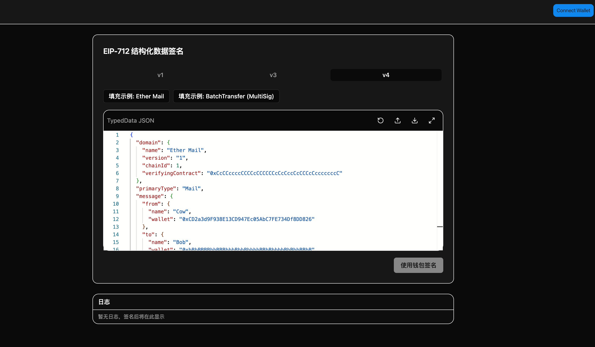

# EIP-712 Signature Tool

A React-based web app that lets you connect a wallet and sign structured data using the [EIP-712](https://eips.ethereum.org/EIPS/eip-712) standard. It provides a JSON editor, multiple signing methods, and live log output.



## Tech Stack

- **Frontend**: React 18 + TypeScript
- **Wallet**: Reown (AppKit) + wagmi + viem
- **UI**: Radix UI + Tailwind CSS
- **Editor**: Monaco Editor (JSON)
- **Code quality**: ESLint + Prettier + Husky + lint-staged

## Features

- **Wallet connection**: Reown connect button (MetaMask, WalletConnect, etc.); show current account and network; disconnect
- **JSON editor**: Monaco syntax highlighting and validation, format, fullscreen, import/export JSON
- **Signing methods**: Tabs for `eth_signTypedData` (v1), `eth_signTypedData_v3`, `eth_signTypedData_v4`
- **Templates**: Predefined examples per method (e.g. MultiSig BatchTransfer); one-click fill
- **Logs**: Real-time signing steps and results in the log panel

## Requirements

- Node.js 18+
- pnpm 9+

## Quick Start

```bash
# Install dependencies
pnpm install

# Development
pnpm dev

# Build
pnpm build

# Preview build
pnpm preview
```

## Environment Variables

Create a `.env` file in the project root and set your Reown project ID (create a project in [Reown Dashboard](https://dashboard.reown.com)):

```env
VITE_REOWN_PROJECT_ID=your_project_id
```

Without this, a placeholder ID is used (suitable for local development only).

## Scripts

| Command             | Description                         |
| ------------------- | ----------------------------------- |
| `pnpm dev`          | Start dev server                    |
| `pnpm build`        | Type-check and build for production |
| `pnpm preview`      | Preview production build locally    |
| `pnpm lint`         | Run ESLint                          |
| `pnpm lint:fix`     | ESLint with auto-fix                |
| `pnpm format`       | Format with Prettier                |
| `pnpm format:check` | Check Prettier formatting           |

## Project Structure

```
src/
├── components/     # Page and UI components
├── config/        # wagmi / Reown config
├── data/          # EIP-712 example templates
├── lib/           # Utilities
├── types/         # Type definitions
├── App.tsx
├── main.tsx
└── index.css
```

## License

MIT
